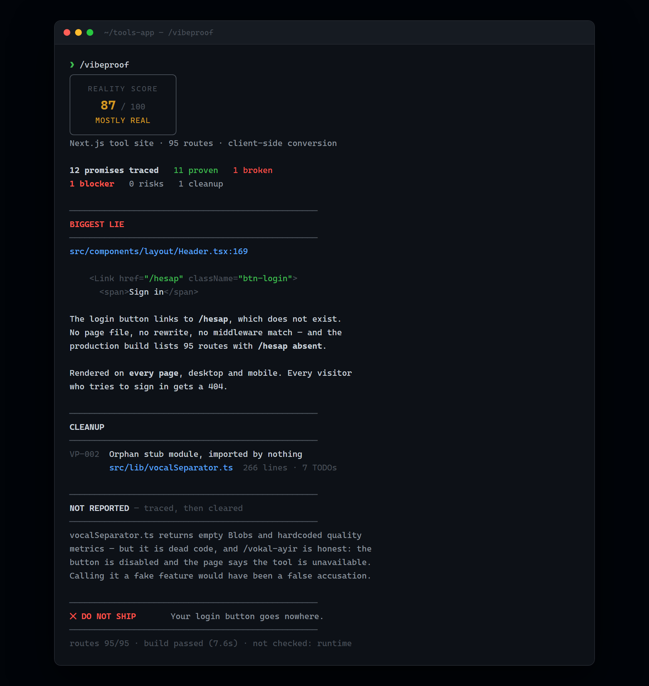

<div align="center">

<br>

# VibeProof

**Your app looks done. Prove it.**

Finds fake features, dead UI, fake persistence, broken wiring and
false-success flows in AI-generated apps.

<br>

[](#install)
[](#install)
[](LICENSE)

<br>



<sub><b>A real run against a production Next.js site.</b><br>
The login button in the header pointed at a route that was never built.</sub>

<br><br>

</div>

> Your AI said it's done.
> Your UI looks done.
>
> **Is it actually done?**

```
/vibeproof
```

No npx. No API key. No config. One markdown file your agent reads.

---

## The problem

Linters inspect your code. VibeProof inspects your **product promises**.

Vibe-coded apps rarely fail because of a syntax error. They fail because something
looks finished and isn't:

- `Delete Account` → `onClick={() => {}}`
- `Save` → updates React state, never reaches the server
- `Payment successful` → toast fires before the API responds
- Dashboard numbers → a hardcoded array
- `Export CSV` → no handler
- `/settings` in the nav → no such route
- Backend throws → `catch { return { success: true } }`
- Edit profile → works, until you refresh

None of that is a bug a linter can see. Every one of them ships.

---

## What it does

VibeProof reads your repo, works out what the app **claims** to do, then follows
each claim through the code:

```
BUTTON → HANDLER → API CALL → SERVER ROUTE → VALIDATION
       → DATABASE → RESPONSE → UI FEEDBACK
```

Wherever that chain breaks, it tells you the file and the line.

---

## Example reports

| | |
|---|---|
| **[A real audit →](examples/real-audit.md)** | A production Next.js site, 95 routes. One blocker — and **two findings it refused to report** after tracing them to the end. |
| **[Annotated example →](examples/sample-report.md)** | A full report with every section: contract, biggest lie, findings, coverage. |

---

## Install

```bash
git clone https://github.com/mrsametyildirim/vibeproof.git
cd vibeproof && ./install.sh
```

Or copy the skill folder yourself:

```bash
cp -r skills/vibeproof ~/.claude/skills/        # Claude Code
cp -r skills/vibeproof ~/.cursor/skills/        # Cursor
cp -r skills/vibeproof ~/.codex/skills/         # Codex
```

It is one `SKILL.md` plus 22 reference files. Nothing to build, nothing to run,
nothing that phones home.

---

## Usage

| Command | What it does |
|---|---|
| `/vibeproof` | Audit the whole repository |
| `/vibeproof diff` | Audit only what changed vs. the default branch |
| `/vibeproof feature checkout` | Trace one flow end to end |
| `/vibeproof security` | The other half — is it safe to ship? |
| `/vibeproof security verify VG-003` | Re-check one finding after you fix it |
| `/vibeproof security clean` | Remove conversational residue and invisible characters |

```
/vibeproof feature authentication

AUTHENTICATION — REALITY

  Signup         ✅ PROVEN
  Login          ✅ PROVEN
  Logout         ✅ PROVEN
  Reset password 🎭 FAKE       success toast, no send call
  Email verify   ⚠️ UNPROVEN   token generated; consumer not found
  Admin guard    💥 BROKEN     client-only check
```

---

## The tripwire

You have to remember to run an audit. You don't have to remember to be interrupted.

The optional `Stop` hook runs a two-second smell test on the files your agent just
wrote — not the audit, just enough to know whether one is worth running.

```
⚠ VibeProof  3 suspicious patterns in the code just written
             (catch block returning success).
             Run /vibeproof diff to verify.
```

When you clean it up, it says so once — and keeps count:

```
✓ VibeProof  2 flagged patterns no longer present. (14 cleared in this repo.)
```

When nothing trips and nothing changed, it prints **nothing at all**. It fires after
every turn, so it had to be nearly silent or it would be disabled within a day.

Note the wording: *"no longer present"*, not *"fixed by VibeProof"*. The tool did not
write your fix. Taking credit for it would be exactly the kind of small lie it exists
to find.

```bash
./install.sh --with-hook     # registers it, backing up settings.json first
./install.sh                 # prints the snippet, changes nothing
```

Opt-in by design: the plain install never touches your settings. `--with-hook`
appends to any existing `Stop` hook rather than replacing it, backs up
`settings.json`, and is safe to run twice.

State lives in `~/.vibeproof/`, never in your repository — a tool whose first rule
is *never modify your code* should not leave litter in your working tree either.

---

## Second opinion

Run VibeProof with a **different agent than the one that wrote the code**.

Cursor built it, Claude audits it. The model that wrote a bug is the model least
likely to see it, because it already believes the code is correct — it produced
the reasoning that led there.

Because it is a plain Agent Skill, the same `SKILL.md` works in Claude Code,
Cursor and Codex.

---

## What it checks

| Category | Catches |
|---|---|
| 🎭 **Fake Features** | Hardcoded data, no-op handlers, mock responses, simulated delays, hardcoded IDs and URLs |
| 🔌 **Broken Wiring** | Links to missing routes, calls to missing endpoints, undefined handlers, uninstalled imports |
| 🤥 **False Success** | Success before `await`, `catch` returning success, ignored HTTP status, swallowed errors |
| 💾 **Fake Persistence** | State-only saves, deletes that only filter an array, uploads that never upload |
| 💀 **Ghost UI** | Dead buttons, orphan components, nav entries to nowhere, missing loading/error/empty states |

---

## Reality Score

| Score | Band |
|---|---|
| 90–100 | 🟢 REAL |
| 75–89 | 🟡 MOSTLY REAL |
| 50–74 | 🟠 VIBEY |
| 25–49 | 🔴 MOSTLY FAKE |
| 0–24 | 🎭 BEAUTIFUL LIE |

The score is arithmetic, not opinion: every finding carries a fixed penalty, so the
same confirmed finding set always scores the same. The ship verdict is decided by
blockers alone — a good score cannot override a blocker.

Working out *which* promises exist is model reasoning, not parsing, so the finding
set itself is not perfectly reproducible. That limit is
[written down](KNOWN-LIMITATIONS.md#2-product-contract-discovery-is-not-deterministic)
rather than papered over.

---

## Two rules it never breaks

**1. It never modifies your code.**
VibeProof reads, traces and reports. An auditor that also patches loses the ability
to be trusted about what was broken. You fix things afterwards, deliberately:

```
fix VP-003
```

**2. It never reports what it cannot quote.**
Every finding carries the file, the line, and the actual source. A finding it cannot
prove is downgraded to `UNPROVEN` and says what would confirm it. Every report ends
with a coverage section listing what it could *not* check.

A tool that cries wolf gets uninstalled after one run.

---

## Two halves of one question

```
Built with AI?   Prove it works.   Prove it's safe.   Then ship it.
```

| | |
|---|---|
| `/vibeproof` | **Does it actually work?** Fake features, dead UI, fake persistence, broken wiring, false success |
| `/vibeproof security` | **Is it safe to ship?** Exposed keys, ownership checks that were never written, open storage, client-side auth |

One skill, one evidence standard. A dead button lies about what the product does;
a client-side admin check lies about who it lets in — both are gaps between the
visible promise and the implementation.

The security half targets how AI-built apps actually fail:

| | |
|---|---|
| **Row-level security** | Off on at least one table in most AI-generated apps. With it off, the anon key is a full read-write key shipped to every visitor |
| **Ownership** | Login is enforced, `project.userId === session.user.id` is not |
| **Secrets** | Which side of the wire, not merely whether one exists — a Supabase anon key in the client is correct, a `service_role` key is total database access |
| **The LLM boundary** | A model emits `refund`, and the refund happens. Nobody checked who asked |
| **Deployment** | `pull_request_target` running fork code with your secrets, `jwt.decode` where `verify` was meant |
| **Source hygiene** | Conversational residue and invisible characters left in shipped source |


```
🔴 BROKEN AUTHORIZATION            app/api/projects/delete/route.ts:14

   Authentication is enforced; ownership is not. The project id comes from the
   request body and is used directly in the delete. An authenticated user can
   delete another user's project by changing one value.

   FIX PROMPT — CLAUDE CODE ▾   FIX PROMPT — LOVABLE ▾
```

Then `/vibeproof security verify VG-003` re-checks it against the code as it is
now — not against what you said you changed.

It never prints ✅ SAFE. The strongest verdict is **NO SHIP-BLOCKING FINDINGS
DETECTED**, because no static pass can certify an application.

---

## Trust model

A tool whose entire claim is *"your app looks done, prove it"* does not get to be
vague about its own gaps.

**[How VibeProof audits itself →](KNOWN-LIMITATIONS.md)**

Known blind spots, the tripwire's real defects, framework coverage, what it
deliberately refuses to claim — and the three bugs it found in its own repository.

**[The VibeProof Corpus →](evals/)** — 18 fixtures, 9 matched pairs. Every broken
example ships with a control that looks almost identical and is correct, because
"it found the bug" is not a result on its own: a tool that flags everything finds
it too. No precision or recall numbers are published yet; there are no recorded
runs to compute them from, and inventing one is exactly what this tool exists to
catch.

> VibeProof prefers an explicit *"I could not verify this"* over invented certainty.

---

## One report, three questions

```
/vibeproof all
```

| Track | Question | Score |
|---|---|---|
| **Reality** | Does it do what it says? | Fake features, dead UI, fake persistence, broken wiring, false success |
| **Security** | Is the trust boundary held? | Secrets, ownership, row-level security, storage, the LLM boundary, deployment |
| **Health** | Will it keep working? | Known CVEs, injection, unbounded queries, missing timeouts, races, code health |

Three scores, **one verdict** — a blocker in any track blocks:

```
REALITY  87/100  🟡 MOSTLY REAL
SECURITY 42/100  🔴 EXPOSED        ← 1 critical
HEALTH   71/100  🟠

SHIP VERDICT  ❌ DO NOT SHIP
```

They stay separate on purpose. Sixty maintainability notes folded into the Reality
Score would make one number mean both *this product lies* and *this variable is
badly named*, and a score that means two things decides nothing.

**What it still refuses to be:** a formatter, a style guide, or a coverage target.
Import order and file length are a linter's job, and putting them in this report
trains you to skim past the finding that stops the release. Code health lists what
hides a defect and counts the rest.

**And it never invents a CVE.** Dependency findings come from `npm audit`,
`pip-audit`, `osv-scanner` and friends — actually run, output actually read. No
auditor available means `UNVERIFIED`, not a clean bill of health.

---

## License

MIT
